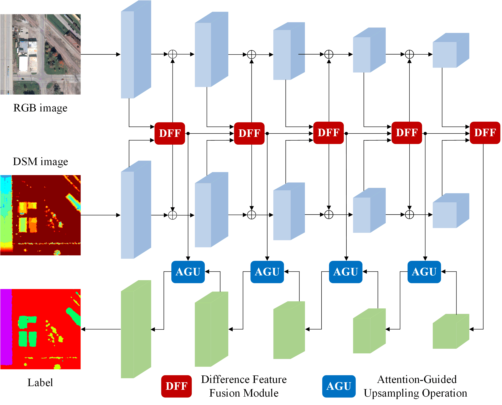

# Multi-source Remote Sensing Images Semantic SegmentationBased on Differential Feature Attention Fusion

## Abstract

Multi-source remote sensing image semantic segmentation can provide more detailed feature attribute information, making it an important research field for remote sensing intelligent interpretation. However, due to the complexity of remote sensing scenes and the feature redundancy caused by multi-source fusion, multi-source remote sensing semantic segmentation still faces some challenges. In this paper, we propose a multi-source remote sensing semantic segmentation method based on differential feature attention fusion (DFAFNet) to alleviate the problems of difficult multi-source discriminant feature extraction and poor quality of decoder feature reconstruction. Specifically, we achieve effective fusion of multi-source remote sensing features through a differential feature fusion module and unsupervised adversarial loss. Additionally, we improve decoded feature reconstruction without introducing additional parameters by employing a attention-guided upsampling strategy. Experimental results show that our method achieved 2.8% and 2.0% mean intersection over union (mIoU) score improvements compared with the competitive baseline algorithm on the available US3D and ISPRS Potsdam data sets, respectively.

